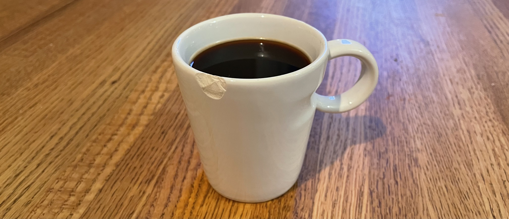

# Resilience Coffee

## What

A twice monthly virtual meetup discussing topics related to resilience engineering. We loosely follow a [Lean Coffee](http://leancoffee.org/) format.

## Why

We are more resilient when we learn from each others' approaches and adapt.

## When, Where, How

First Thursdays are Americas' afternoons and Friday morning in [APAC](https://en.m.wikipedia.org/wiki/Asia-Pacific).

Third Fridays are [EMEA](https://en.m.wikipedia.org/wiki/Europe,_the_Middle_East_and_Africa) afternoons and Americas' mornings.

<iframe src="https://calendar.google.com/calendar/embed?height=250&wkst=1&bgcolor=%237986CB&ctz=America%2FChicago&showTitle=0&showDate=0&showNav=0&showPrint=0&showTabs=0&showCalendars=0&mode=AGENDA&src=anJnZnQyYmthYmJzczZvMjgyZG1rcXNoM29AZ3JvdXAuY2FsZW5kYXIuZ29vZ2xlLmNvbQ&color=%23D50000" style="border:solid 1px #777" width="800" height="250" frameborder="0" scrolling="no"></iframe>

----

<a rel="me" href="https://rls.social/@resiliencecoffee">Mastodon</a> | [Code of Conduct](https://github.com/resilience-coffee/resilience-coffee.org/blob/main/CODE_OF_CONDUCT.md)
